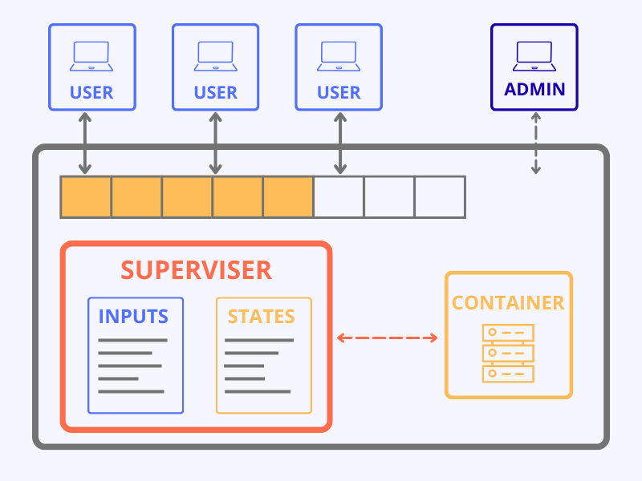

## Abstract

It so happens with many topics in Computer Science that it is far easier to grasp
a concept when it is taught via demonstration and hands-on experience than when it is simply
read from a book, or taught in a class lecture. With recent development in containerization
of various systems, it is now possible to craft containers that provide such experience while
being easier to set up and deploy in various environments. Such a method is not without its
shortcomings however. Since a containers seeks to run its own miniature subsystem, running
the container can take up significant amount of RAM and processing power which may not be readily
available to everyone partaking in a course. Also, setting up such a system without previous knowledge
on how containers work can be challenging for those participating in such a course. For any container that gets
deployed on a student machine, there is no way for the instructor of the course to view or verify
progess made, and any edits that are made to the container thereafter cannot be easily deployed to client
systems without some sort of external interaction. This makes using containers directly in courses hard to
distribute and maintain.

Is it possible to create a system that allows us to create a system that allows us to create, update and
manage many such containers easily, while also solving all of the above problems?

## Introduction

As a first thought, what one might do to solve such a problem might be to keep a central record of the
updated container image, and expect the sister images to update themselves to match this central image.
This would require a dedicated server to store all required containers in thier updated state and serve
them to the student computers at the time of the lesson. However, this does not solve the problem of still
requiring the students to download and update containers to be able to participate in the course. Thus, instead
of keeping only one copy of the container, the server would be required to maintain a separate copy for each
student participating in the course and allow the student to connect to the server to use the container.

While such a system does help with overcoming some of our previous challenges, it does not
come close to achieving what we initially set out to do. While we do solve the problem of having to individually
require each student to update and run thier own copy of the container, having a single server host all of the
containers creates its own issue. Namely, how do we reliably host a large number of containers on a single machine?
Assuming that a course has around 300 applicants, and there are about 10 such courses in an institution that seek
to use such a server, we arrive at a whopping 3000 containers that need to run simultaneously while serving the same
number of clients! Moreover, in case a new student has to be accomodated into the program, a new container will need to
be hosted with the current load to accomodate the new entry. If a student makes multiple connections to the server
due to overload/disconection or a container fails, the server will have no way to retrieve the student's progress.
Finally, since all the jobs running on the server are infact the same container, most commands running on the job
will also be similar. This means that if a container requires a certain set of specific commands to complete, then
each those commands will be run atleast 3000 different times, even though the output could be achieved by running the
command only once.  
It is abundantly clear that this is not the best approach.

## Method

Instead of running multiple copies of the same program, one can instead store the states of
the container as it runs. The 'state' of a program could be defined as the value of its cpu registers, along with
any IO operations it tried to perform and the content of its memory. Since all clients use the same container,
all clients would initially begin at the same state of the container. Whenever a client issued a command, the container
would execute that command, and in-turn change its state. Thus, whenever a new command is issued, we could also store how the
state of the container changed. For example, if the container changed its state from q0 to q1 after recieving an intruction i1,
then we could store that running i1 changed q1 in q0. If we wanted to arrive at the resultant state when i1 was run from state q0,
we could then simply apply the changes in q1 to q0. Thus for any sequence of instructions whose states were stored in memory, the
final resultant state could be attained by consecutively applying the changes used to arrive at each intermediate state. Thus, all
commands from any given state would only need to be executed once and sebsequently retrieved from the program cache! Furthermore,
commands that have known state deltas(changes) can be simulated without running them on the container.

By separating the execution of commands from the recieving of those commands, it is possible to remove the need for multiple containers
thus solving the problems caused by the previous approach. By allowing access to supervizer program, it should also be possible to monitor
and edit running processes and states on containers and easily backup and restore progress of clients using the service of the containers
through the program. It should also be possible to disbtribute the load on the server by hosting the containers on separate machines allowing
for smoother experience.

## Conclusion

The process by which we abstract away the container(resource) itself from the the users of the resource so that multiple independent users
can share the same resource is called **Virtualization**. By means of virtualization, it is possible to solve earlier issues while keeping
the system centralized and easy to maintain.

